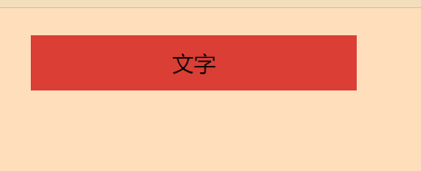

# css世界笔记

## 流

### 块级元素

块级元素常见的有 `<div>` 、 `<li>` 、和 `<table>` ，块级元素并不意味着 `display: block` ， `<table>` 的 `display` 是 `table` ， `<li>` 的 `display` 的值是 `list-item` 。块级元素的特征在于一个水平流上只能单独显示一个元素，多个块级元素则换行显示。

“块级元素”具有换行特性，因此理论上它们可以使用 `clear` 来清除浮动的影响。

``` css
.clear::after {
    content: '';
    display: block;
    clear: both;
}

.box {
    background: red;
    padding: 10px;
}

.box>img {
    float: left;
}
```

### list-item 的项目符号与 inline-block 与 inline-table

为了能让 CSS 实现更多功能而添加来的有别于 `block` 与 `inline` 两大基础 `display` 值，而添加进来的新 `display` 值。

同理， `inline-block` 也是这么被添加进来的，这个属性使得元素既能像 `inline` 属性与图文存在于同一行，又能像 `block` 属性可以改变宽高，也即是一个外部像 `inline` ，内部像 `block` 一样的容器。

`inline-table` 也即外部像 `inline` ，内部像 `table` 的容器，它可以生成一个与图文存在同一行的表格。

``` html
<div id="app">
    和文字平起平坐：
    <table>
        <tr>
            <td>hello</td>
            <td>world</td>
        </tr>
    </table>
</div>
```

``` css
#app>table {
    display: inline-table;
}
```

### width: auto; 的用途

`width` 的默认值是 `auto` ，它包含了至少以下四种不同的宽度表现：

* 充分利用可用空间。比如说， `<div>` 、 `<p>` 这些元素的宽度默认是 100% 于父级容器的。这种充分利用可用空间的行为有个专门的名字叫做 fill-available 。
* 收缩与包裹。典型代表就是浮动、绝对定位、 `inline-block` 元素或 `table` 元素，英文称为 shrink-to-fi ，直译为“收缩到合适”，也可以叫做“包裹性”， `fit-content` 指的就是这种宽度表现。
* 收缩到最小。这个最容易出现在 `table-layout` 为 `auto` 的表格中。当一行不够时，英文单词是不能断的，这种行为被描述为“preferred minimum width”或者“minimum content width”。
* 超出容器限制。除非有明确的 `width` 相关设置，否则上面三种情况尺寸都不会主动超过父级容器宽度，但是存在特殊情况，内容很长的连续的英文和数字，或者内联元素被设置了 `white-space: nowrap` ，表现会超过父级容器宽度。

``` css
.father {
    width: 150px;
    background-color: #cd0000;
    white-space: nowrap;
    padding: 10px;
}

.child {
    display: inline-block;
    background-color: #f0f3f9;
}
```

``` html
<div class="father">
    <div class="child">Lorem ipsum dolor sit</div>
</div>
```


子元素保持了 `inline-block` 元素的收缩性，又使得内容宽度最大，无视了父级容器的宽度限制，这种特性后来有了属性值描述为 `max-content` 。

#### 外部尺寸与流动特性

##### 正常流宽度

在页面内部放置一个 `<div>` 元素，它能够像水流般铺满容器，这是 `block` 容器的特性。

``` css
a {
    display: block;
    width: 100%;
}
```

在这里 `<a>` 标签被设置成了 `block` ， `block` 具有了流动性，实际上是不需要 `width: 100%` ，块级元素一旦设置了宽度就丢失了流动性了。

实际开发时不会设置宽度 100% 的。在我们为导航设置成 `block` 后，我们即可以借助流动性无宽度布局。

``` css
.width {
    width: 100%;
}

.nav {
    background-color: #cd0000;
}

.nav-a {
    display: block;
    margin: 0 10px;
    padding: 9px 10px;
    border-bottom: 1px solid #b70000;
    border-top: 1px solid #de3636;
    color: #fff;
}

.nav-a:first-child {
    border-top: 0;
}

.nav-a+.nav-a+.nav-a {
    border-bottom: 0;
}
```

``` html
<h4>width:100%</h4>
<div class="nav">

    <a href="" class="nav-a width">导航1</a>
    <a href="" class="nav-a width">导航2</a>
    <a href="" class="nav-a width">导航3</a>

</div>
```

我们在这里为 `a` 标签设置了 `width: 100%` ，却使得 `a` 标签的尺寸超过了容器的尺寸。


因此无宽度这个准则使得代码少了维护，能使容器可以自适应父容器。

##### 格式化宽度

格式化宽度出现在“绝对定位模型中”，也就是出现在 `position` 属性值为 `absolute` 或 `fixed` 的元素中。在默认情况下，绝对定位元素的宽度表现为“包裹性”，宽度由内部尺寸决定。

有一种情况元素尺寸会由外部元素决定，

当 `right/left` 或 `bottom/top` 同时存在时，元素的宽度表现为“格式化宽度”，其宽度大小相对于最近的具有定位特性（ `position` 属性值不是 `static` ）的祖先元素计算。例如:

``` css
div {
    position: absolute;
    left: 40px;
    right: 40px;
}
```

假设离它最近的祖先级定位元素长度为 1000px ，那么这个元素的宽度就是 1000px - 40px - 40px = 920px 。

#### 内部尺寸与流体特性

内部尺寸是指元素的宽度由内部元素内容决定，如果这个元素内部没有内容，宽度为0，那么它就具有内部尺寸。

##### 包裹性

包裹性是对 shrink-to-fit 的一种称谓，包裹性除了有“包裹”，还具有“自适应性”。

自适应性是指元素尺寸由内部元素决定，但永远小于“包含块”容器的尺寸（除非容器小于元素的“首选最小宽度”）。

对于一个元素，如果其 `display` 属性值是 `inline-block` ，那么即使其里面内容再多，只要是正常文本，宽度不会超过容器。除非“首选最小宽度”比容器宽度还大，否则我们完全不需要担心某个元素内容太多而破坏了布局。

``` html
<button>按钮</button>
<input type="button" value="按钮">
```

按钮就是 CSS 世界中最有代表性的 `inline-block` 元素，具体表现为：按钮文字越多宽度越宽（内部尺寸特性），但如果文字太多，也会在容器的宽度处自动换行。

`<button>` 会换行， `<input>` 按钮默认 `white-space: pre` 是不会换行的，需要将 `pre` 值重置为 `normal` 。

如果我们有这样的需求：页面某个模块的文字内容是动态的，可能是几个字，也可能是一句话。然后，希望文字少的时候居中显示，文字超过一行的时候居左显示。

``` css
.box {
    text-align: center;
    padding: 10px;
    background-color: #e44848;
}

.content {
    text-align: left;
    display: inline-block;
}
```




除了 `inline-block` 元素，浮动元素以及绝对定位元素都具有包裹性。

##### 首选最小宽度

首选最小宽度是指元素最适合的最小宽度。

在 CSS 中，图片和文字的权重是要大于布局的，因此 CSS 的设计不会让图文在 `width: auto` 时让宽度为0的。此时表现的宽度就是“首选最小宽度”。

* 东亚文字，最小宽度为每个汉字的宽度，
* 西方文字最小宽度由特定的连续的英文字符单元决定。并不是所有英文字符都会组成连续单元，一般会终止于空格、短横线、问号及其它非英文字符。

如果想让英文字符和中文一样，每一个字符都用最小宽度单元，可以尝试 `word-break: break-all` 。

在 IE8 中，CSS 中的盒阴影和背景渐变全都无法使用，可以利用“首选最小宽度”的行为特点把需要的图形勾勒出来。

``` css
.ao {
    font-size: 14px;
    display: inline-block;
    width: 0;
    margin: 35px;
    color: #ffffff;
}

.ao::before {
    content: "love 你 love";
    outline: 2px solid #adadad;
}
```


##### 最大宽度

最大宽度就是元素可以有的最大宽度。最大宽度等同于“包裹性”元素设置`white-space: nowrap`声明后的宽度。如果内部没有块级元素或者块级元素没有设定宽度值，则最大宽度实际是最大连续内联盒子的宽度。

这里可以将内联盒子简单地理解为`display`的值是`inline`、`inline-block`、`inline-table`等元素。连续内联盒子指的是全部都是内联级别的一个或一堆元素，中间没有任何的换行标签或其它块级元素。

### CSS 流体布局下的宽度分离原则

所谓宽度分离原则，就是 CSS 中的`width`属性不与影响宽度的`padding/border`（有时候包括`margin`）属性共存，也就是不能出现以下的组合：

```css
.box{
    width: 100px;
    border: 1px solid;
}
```

```css
.box{
    width: 100px;
    padding: 20px;
}
```

正确的写法应当是：

```css
.father{
    width: 180px;
}

.son{
    margin: 0 20px;
    padding: 20px;
    border: 1px solid;
}
```

#### 为何要宽度分离

宽度分离是为了便于维护。

```css
.box{
    width: 100px;
    border: 1px solid;
}
```

在这个容器内，如果我们希望元素边框内有 20 像素的留白，此时如果我们增加`padding`设置：

```css
.box{
    width: 100px;
    padding: 20px;
    border: 1px solid;
}
```

结果此时的宽度变成了 142 像素，比原来大了 40 像素，原因在于这个容器的宽度等于`content`+`padding`的结果。

如果使用宽度分离：

```css
.father{
    width:102px;
}

.son{
    border: 1px solid;
}
```

嵌套一层标签，父元素定宽，子元素因为`width`使用的是默认值`auto`，所以会如水流般自动填满父级容器。如果设计师希望元素边框内有 20 像素的留白，我们增加`padding`设置：

```css
.father{
    width: 102px;
}

.son{
    border: 1px solid;
    padding: 20px;
}
```

在这里我们就不需要任何计算了，浏览器会自动的计算，完全不必担心尺寸的变化。

对于绝大多数网页，只需要一个`width`设定就可以了，就是最外层用于限制网页主体内容宽度的那个`width`，而里面的所有内容都无需再出现`width`设置。但这种无宽度网页布局是需要很深的 CSS 积累才能驾驭自如的。

### 改变 width/height 作用细节的 box-sizing

#### box-sizing 作用

`box-sizing`可以被叫做“盒尺寸的作用细节”，或者就是改变`width`的作用细节。

目前这个属性只支持`content-box`与`border-box`。

`box-sizing: border-box`就是让 100 像素的宽度直接作用在 border box 上，从默认的 content box 变成 border box 。那么 content box 就会从宽度值中被释放，与 padding 一起自动被分配`width`值。

```css
.box{
    width: 100px;
    box-sizing: border-box;
}
```

与

```css
.box{
    width: 100px;
    border: 20px;
    box-sizing: border-box;
}
```

与

```css
.box{
    width: 100px;
    border: 20px;
    padding: 20px;
    box-sizing: border-box;
}
```

宽度大小都是一致的 100 像素。

#### box-sizing 不支持 margin-box

`margin-box`不支持的理由在于它本身是没有价值的，如果一个元素使用`width`或者`height`设置好了尺寸，此时设置`margin-box`并不能改变它的`offset`尺寸。`margin`只有在`width`为`auto`的时候才能改变元素的尺寸，但是此时元素已经处于流动状态，根本就不需要`box-sizing`了。

另外，对于 margin-box 而言，它是不可见的，如果需要`box-sizing`支持`margin-box`，它就不得不支持 margin-box 的背景色。

#### *{box-sizing: border-box} 的使用

不要使用，不要使用，不要使用！

这种做法造成了没必要的消耗，对于普通内联元素，`box-sizing`并不能影响到它的尺寸表现，同时一些元素的`box-sizing`默认就是`border-box`，对于它们而言，通配符也是没有必要的。

#### box-sizing 发明的初衷

在 CSS 中，唯一离不开的是`box-sizing: border-box`的原生普通文本框`<input>`和`<textarea>`的 100% 自适应父容器宽度。

替换元素的特性之一是尺寸由内部元素决定，无论其`display`属性值是`inline`还是`block`。

`<textarea>`就是一个替换元素，所以，我们只能通过`width`设定让`<textarea>`尺寸 100% 自适应父容器，然而`<textarea>`是有`border`的，而且需要`padding`，否则输入的光标会顶着边框，因而，`width/border`和`padding`注定要共存，同时还要整体 100% 宽度自适应容器。

如果我们使用了`box-sizing: border-box`就能允许让非替换元素在`width`明确设定为 100% 的条件下，让它的`padding`与 content-box 能够自适应。

`box-sizing: border-box`看起来使用的目的是为了解决替换元素自适应问题。

### height: auto

`height: auto`使用起来就比`width: auto`要单纯些，有多少个元素，它们的高度累加就是`height: auto`的高度值了。

### height: 100%

对于父元素，如果`height`为`auto`，只要子元素在文档流中，其百分比完全就被忽略了。

#### height: 100% 无效的原因

如果包含块的高度没有显示指定，并且该元素不是绝对定位，则计算值为`auto`，`auto`是无法与百分比计算的。

但是，宽度的解释是：如果包含块的宽度取决于该元素的宽度，那么产生的宽度布局实际是“未定义行为”，将由浏览器自行解释。

#### 让元素支持 height: 100% 的效果

##### 设定显示的高度值

给父元素来个具体的高度值，或者可以生效的百分比值。

```css
html, body{
    height: 100%;
}
```

##### 使用绝对定位

```css
div{
    height: 100%;
    position: absolute;
}
```

此时的`height: 100%`会有计算值，即使祖先元素的`height`计算为`auto`也会生效。

绝对定位的宽高百分比计算相对于 padding box 的，也就是会把 padding box 大小值计算在内。非绝对定位元素则是相对于 content box 的。

### min-width/max-width和min-height/max-height

`min-width/max-width`使用的场景必然是自适应布局或者流体布局中，在`width/height`定死的布局中，`min-width/max-width`就没有任何效果，它们具有边界行为的属性，没有变化自然无法触发。

```css
.container{
    min-width: 1200px;
    max-width: 1400px;
}
```

可以看到无需`width`设置，直接使用`min-width`或`max-width`即可。

为了避免图片在移动端展示过大影响体验，常常会有如下设置：

```css
img{
    max-width: 100%;
    height: auto !important;
}
```

#### `min-width`与`max-width`不同的初始值

`min-width/min-height`
