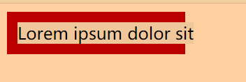
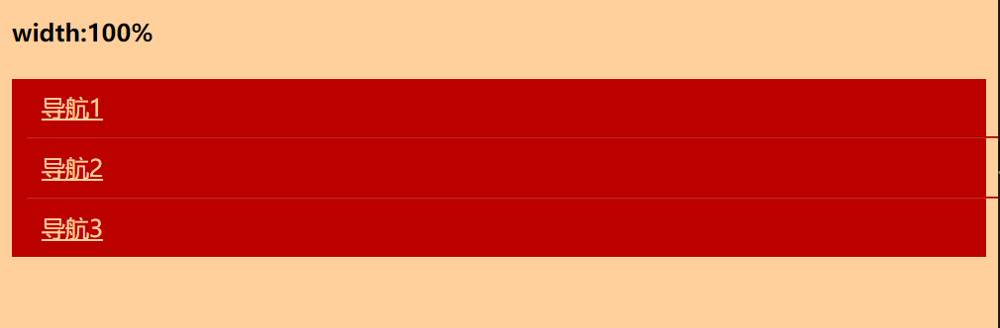

# css世界笔记

## 流

### 块级元素

块级元素常见的有 `<div>` 、 `<li>` 、和 `<table>` ，块级元素并不意味着 `display: block` ， `<table>` 的 `display` 是 `table` ， `<li>` 的 `display` 的值是 `list-item` 。块级元素的特征在于一个水平流上只能单独显示一个元素，多个块级元素则换行显示。

“块级元素”具有换行特性，因此理论上它们可以使用 `clear` 来清除浮动的影响。

``` css
.clear::after {
    content: '';
    display: block;
    clear: both;
}

.box {
    background: red;
    padding: 10px;
}

.box>img {
    float: left;
}
```

### list-item 的项目符号与 inline-block 与 inline-table

为了能让 CSS 实现更多功能而添加来的有别于 `block` 与 `inline` 两大基础 `display` 值，而添加进来的新 `display` 值。

同理， `inline-block` 也是这么被添加进来的，这个属性使得元素既能像 `inline` 属性与图文存在于同一行，又能像 `block` 属性可以改变宽高，也即是一个外部像 `inline` ，内部像 `block` 一样的容器。

`inline-table` 也即外部像 `inline` ，内部像 `table` 的容器，它可以生成一个与图文存在同一行的表格。

``` html
<div id="app">
    和文字平起平坐：
    <table>
        <tr>
            <td>hello</td>
            <td>world</td>
        </tr>
    </table>
</div>
```

``` css
#app>table {
    display: inline-table;
}
```

### width: auto; 的用途

`width` 的默认值是 `auto` ，它包含了至少以下四种不同的宽度表现：

* 充分利用可用空间。比如说， `<div>` 、 `<p>` 这些元素的宽度默认是 100% 于父级容器的。这种充分利用可用空间的行为有个专门的名字叫做 fill-available 。
* 收缩与包裹。典型代表就是浮动、绝对定位、 `inline-block` 元素或 `table` 元素，英文称为 shrink-to-fi ，直译为“收缩到合适”，也可以叫做“包裹性”， `fit-content` 指的就是这种宽度表现。
* 收缩到最小。这个最容易出现在 `table-layout` 为 `auto` 的表格中。当一行不够时，英文单词是不能断的，这种行为被描述为“preferred minimum width”或者“minimum content width”。
* 超出容器限制。除非有明确的 `width` 相关设置，否则上面三种情况尺寸都不会主动超过父级容器宽度，但是存在特殊情况，内容很长的连续的英文和数字，或者内联元素被设置了 `white-space: nowrap` ，表现会超过父级容器宽度。

``` css
.father {
    width: 150px;
    background-color: #cd0000;
    white-space: nowrap;
    padding: 10px;
}

.child {
    display: inline-block;
    background-color: #f0f3f9;
}
```

``` html
<div class="father">
    <div class="child">Lorem ipsum dolor sit</div>
</div>
```



子元素保持了 `inline-block` 元素的收缩性，又使得内容宽度最大，无视了父级容器的宽度限制，这种特性后来有了属性值描述为 `max-content` 。

#### 外部尺寸与流动特性

##### 正常流宽度

在页面内部放置一个 `<div>` 元素，它能够像水流般铺满容器，这是 `block` 容器的特性。

``` css
a {
    display: block;
    width: 100%;
}
```

在这里 `<a>` 标签被设置成了 `block` ， `block` 具有了流动性，实际上是不需要 `width: 100%` ，块级元素一旦设置了宽度就丢失了流动性了。

实际开发时不会设置宽度 100% 的。在我们为导航设置成 `block` 后，我们即可以借助流动性无宽度布局。

``` css
.width {
    width: 100%;
}

.nav {
    background-color: #cd0000;
}

.nav-a {
    display: block;
    margin: 0 10px;
    padding: 9px 10px;
    border-bottom: 1px solid #b70000;
    border-top: 1px solid #de3636;
    color: #fff;
}

.nav-a:first-child {
    border-top: 0;
}

.nav-a+.nav-a+.nav-a {
    border-bottom: 0;
}
```

```html
<h4>width:100%</h4>
<div class="nav">

    <a href="" class="nav-a width">导航1</a>
    <a href="" class="nav-a width">导航2</a>
    <a href="" class="nav-a width">导航3</a>

</div>
```

我们在这里为`a`标签设置了`width: 100%`，却使得`a`标签的尺寸超过了容器的尺寸。



因此无宽度这个准则使得代码少了维护，能使容器可以自适应父容器。

##### 格式化宽度

格式化宽度出现在“绝对定位模型中”，也就是出现在`position`属性值为`absolute`或`fixed`的元素中。在默认情况下，绝对定位元素的宽度表现为“包裹性”，宽度由内部尺寸决定。

有一种情况元素尺寸会由外部元素决定，

当`right/left`或`bottom/top`同时存在时，元素的宽度表现为“格式化宽度”，其宽度大小相对于最近的具有定位特性（`position`属性值不是`static`）的祖先元素计算。例如:

```css
div{
    position: absolute;
    left: 40px;
    right: 40px;
}
```

假设离它最近的祖先级定位元素长度为 1000px ，那么这个元素的宽度就是 1000px - 40px - 40px = 920px 。

#### 内部尺寸与流体特性

内部尺寸是指元素的宽度由内部元素内容决定，如果这个元素内部没有内容，那么它就具有内部尺寸。


